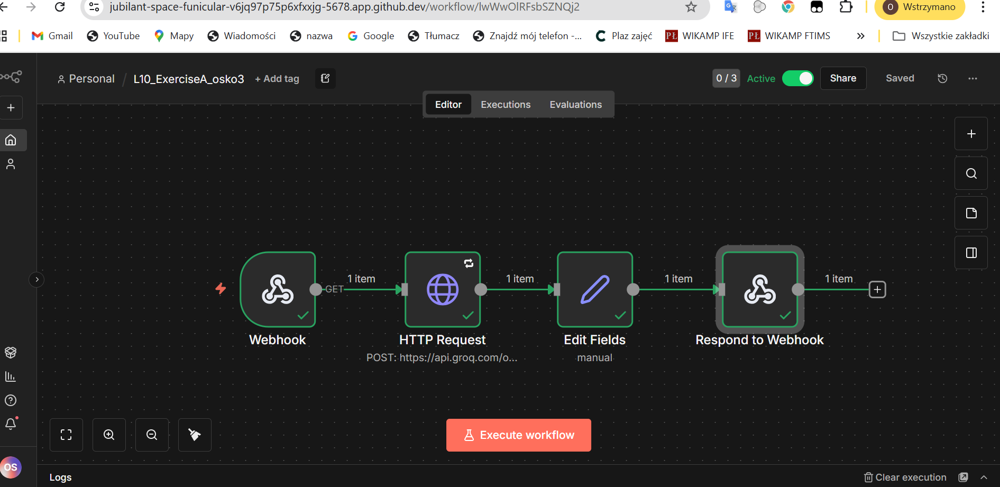
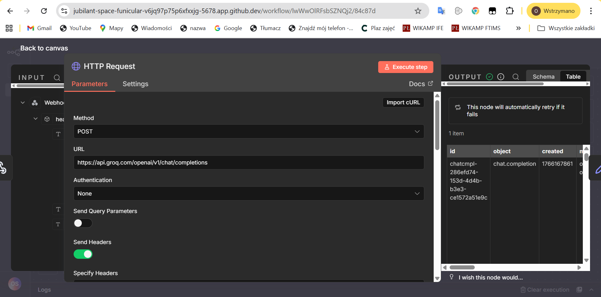
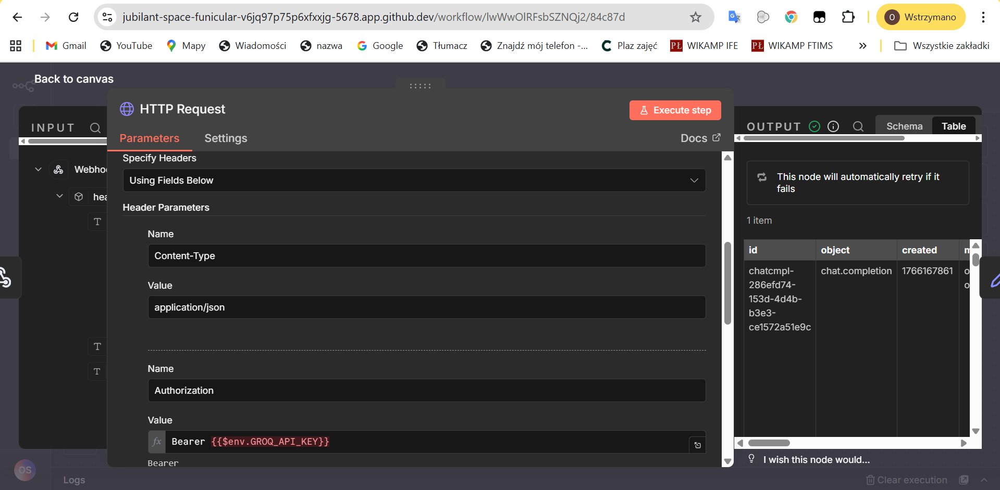
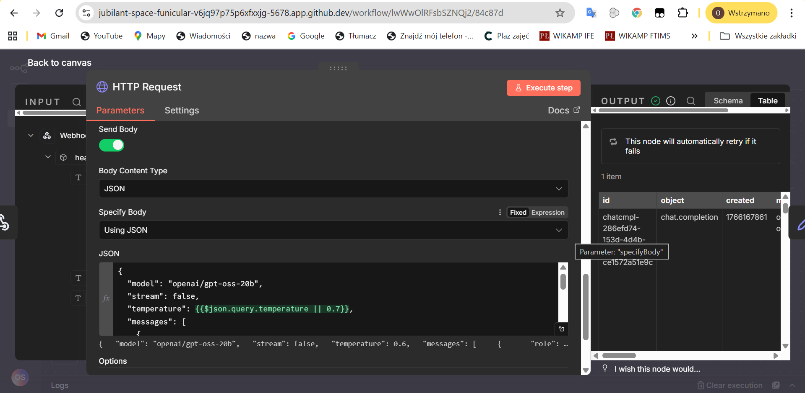
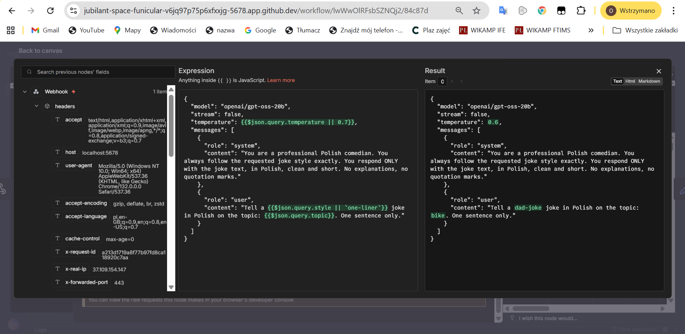
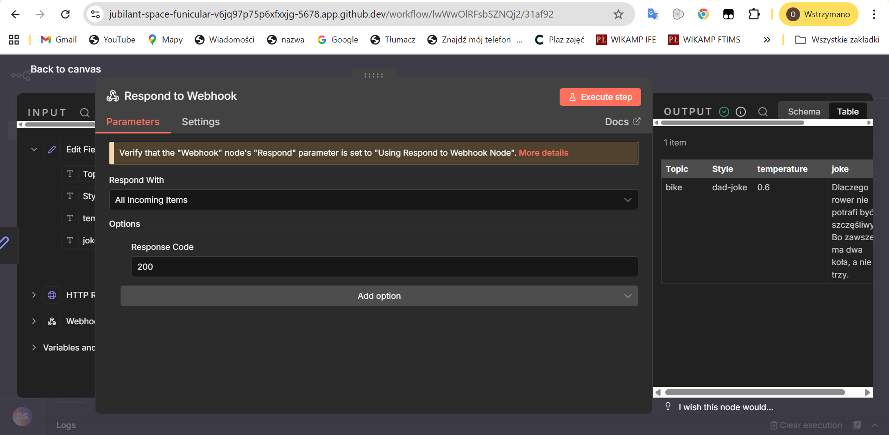
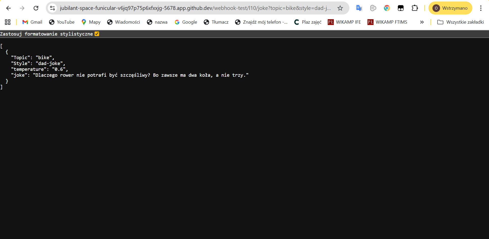

# Short explanation:
I set up a simple API that takes a topic through a Webhook and uses Groq's LLM to generate a clean joke in Polish. I made sure to use environment variables for the API key to keep it secure and added a Set node to map the response into a clean JSON format. It’s a quick way to get a structured laugh directly from a URL.

# Screenshots:

