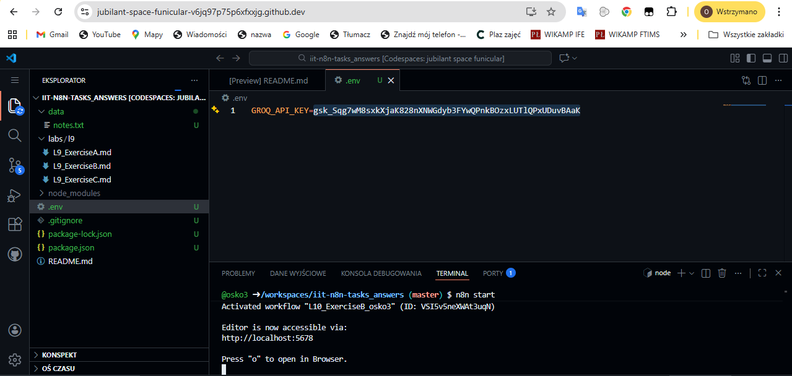

# Short explanation:
I built a data pipeline that scrapes web pages using Jina.ai and then processes that content with an LLM to create structured summaries. Since some pages are huge, I added a bit of JavaScript logic to trim the text so it doesn't hit the model's token limit. The final step ensures that the person calling the webhook gets only the clean JSON data they need, without all the extra API metadata.

# Screenshots:

